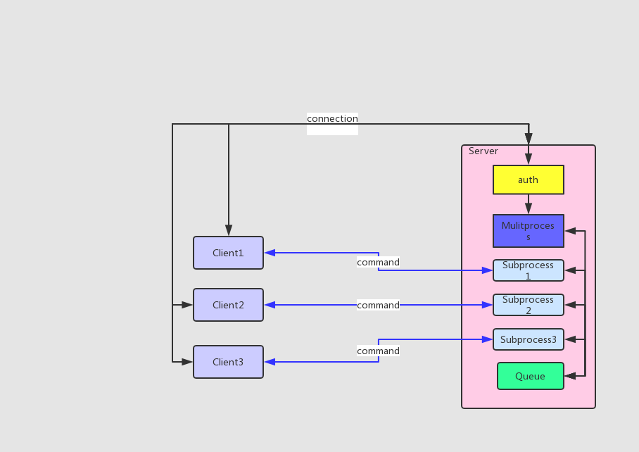

## 开发一个支持多用户同时在线的FTP程序

#### 需求
---
    1. 用户加密认证
    2. 允许多用户同时登录 (多线程处理客户端连接)
    3. 每个用户都有自己的家目录，且只能访问自己的家目录
    4. 对用户进行磁盘分配，每一个用户的可用空间可以自己设置
    5. 允许用户在ftp server上随意切换目录
    6. 允许用户查看自己家目录下的文件
    7. 允许用户上传和下载，保证文件的一致性（md5）
    8. 文件上传、下载过程中显示进度条
    9. 支持文件的断点续传, 可以移动或删除或重命名家目录中的文件与目录，可以在家目录下创建目录
    10. 支持多并发的功能
    11. 使用队列queue模块，实现线程池
    12. 允许用户配置最大的并发数，比如允许只有10并发用户   
    
    
#### 开发环境
___
 - Windows 10
 - Python 3.6.8
 - Pycharm 2019.1
 
 
#### 需求分析
---
    一、功能：
        1、多用户同时登录：通过ThreadPoolExecutor控制并发数，并通过Threadlocal来隔离线程间的信息
        2、用户家目录：在创建登录用户时自动创建
        3、每个用户分配一个虚拟空间：（真正的磁盘配额过于复杂）,所有用户的总空间不能大于所在磁盘分区的空间，上传的文件不能大于用户空间
        4、可以在家目录下切换目录或多级子目录: 切换目录是基于当前目录而不是家目录
        5、可以在家目录下查看所有文件与子目录：也是基于当前目录而不是家目录
        6、可以在家目录创建目录：也是基于当前目录而不是家目录
        7、上传文件与下载文件（支持续传，显示进度条）
            a. 文件续传：上传与下载时先写入一个临时文件，检验MD5一致后才rename为上传下载的文件，
               上传下载时先检测是否有这个临时文件，有就直接续传
        8、可以移动或删除或重命名家目录中的文件与目录： 也是基于当前目录而不是家目录

    二、数据交互：  
        1、客户端与服务端，发送所有指定前，先发送一个包含指令信息的等长包头给对方
        2、双方通过解析包头来判断要执行什么指令
        
 
    三、项目目录结构：
        FTPProject
        |-- README.md        # 说明文档
        |-- client           # 客户端程序
        |   |-- __init__.py
        |   |-- bin
        |   |   |-- __init__.py
        |   |   `-- start.py       # 程序入口
        |   |-- conf
        |   |   |-- __init__.py
        |   |   `-- settings.py    # 程序全局配置
        |   |-- core
        |   |   |-- __init__.py
        |   |   `-- ftp_client.py  # 程序核心模块
        |   |-- data               # 默认用户数据目录
        |   `-- modules                 # 功能模块目录
        |       |-- __init__.py
        |       |-- colored.py          # 彩色字体输出
        |       |-- get_md5.py          # 获取对象MD5值
        |       |-- get_partition_size.py   # 获取磁盘分区可用空间
        |       |-- progress_bar.py         # 进度条
        |       |-- serialization.py        # 数据序列化
        |       |-- size_format.py          # 字节单位转换
        |       `-- strip_input.py          # 默认strip的input方法
        `-- server              # 服务端程序
            |-- __init__.py
            |-- bin
            |   |-- __init__.py
            |   `-- start.py    # 程序入口
            |-- conf
            |   |-- __init__.py
            |   `-- settings.py   # 全局配置
            |-- core
            |   |-- __init__.py
            |   `-- ftp_server.py  # 核心功能模块
            |-- data               # 数据目录
            |   |-- db              # 用户帐户数据
            |   |   `-- userdb.json
            |   |-- home            # 用户家目录
            |   |   |-- jack
            |   |   |-- jushua
            |   |   |-- payne
            |   |   `-- robin
            |   `-- logs            # 日志目录
            |       |-- access.log
            |       |-- error.log
            `-- modules             功能模块
                |-- __init__.py
                |-- get_dir_attr.py     # 获取目录文件与子目录及相关属性
                |-- get_md5.py          # 获取对象MD5
                |-- get_partition_size.py   # 获取磁盘分区可用空间
                |-- logger.py               # 日志记录
                |-- make_account.py         # 创建帐号
                |-- serialization.py        # 数据序列化
                |-- size_format.py          # 字节单位转换
                `-- strip_input.py          # 默认strip的input方法

### 流程图
---

### 运行程序
___
    服务端：
    `python3 server/bin/start.py create_user  # 创建登录用户`
    `python3 server/bin/start.py run          # 运行FTP服务器`
     
    客户端：
    `python3 clint/bin/start.py               # 运行FTP客户端`

### 用户帐户信息
    请通过服务端创建用户
    
### 程序运行效果
---
##### 服务器：
###### 创建用户：
---
    ========帐号配置,退出请按[b|B]========
    请设置帐号>>>: egon
    请设置不小于6位数的登录密码>>>: 123456
    所在分区可用容量:[283.31G],请设置存储空间大小,单位:[M,G,T],>>>: 500M
    ========帐号配置,退出请按[b|B]========
    [egon]帐号注册成功: {'storage': 524288000, 'home': 'egon', 'password': 'e10adc3949ba59abbe56e057f20f883e'}

###### 运行服务器：
---
    主进程: [12340] Waiting for connections...
###### 客户端连接
    子进程: 14144; New connection form client: ('127.0.0.1', 58672)
###### 客户端用户登录
    [jack]登录成功                                           
###### 客户端主动断开链接
    ConnectionResetError: client actively disconnected the link
    [jack]退出登录
    ('127.0.0.1', 58679)链接已关闭
###### 客户端异常中断
    ConnectionResetError: [WinError 10054] 远程主机强迫关闭了一个现有的连接。  
    [jack]退出登录
    ('127.0.0.1', 58695)链接已关闭
    
 
##### 客户端：
###### 连接登录
    成功连接到服务器:[('127.0.0.1', 8888)]
    User>>>: jack
    Password>>>: 1234567
    密码错误
    User>>>: jack
    Password>>>: 123456
    [jack]登录成功
    请输入要执行的操作[help:查看帮助信息;exit:退出]
    [jack]:[jack]>>: 
 
###### 查看帮助
    [jack]:[jack]>>: help

            help command[mkdir,cd,ls,quota,get,put,show] : 查看指定命令的帮助信息
            
###### 查看相关命令帮助
    [jack]:[jack]>>: help quota
    
                quota action size : 调整家目录空间大小,支持单位[M,G,T]
                    eg: ['quota = 500M'] 调整为500M空间
                        ['quota + 50M']  增加50M空间
                        ['quota - 50M']  减小50M空间
                
    [jack]:[jack]>>: help get
    
                get file [save_dir] : 下载文件，未指定本地目录则下载到客户端定义的数据主目录下，如有指定但目录不存在将在数据目录下自动创建目录
                    eg: ['get a.txt']            下载当前目录下的a.txt文件到本地当前目录
                        ['get abc/a.txt test']   下载当前目录下的abc目录下的a.txt文件到本地test目录
                        ['get /abc/a.txt']       下载家目录下的abc目录下的a.txt文件到本地当前目录

###### 查看当前用户信息
    [jack]:[jack]>>: show

        ----- [jack]INFO -----
        HOME_DIR: jack
        WORK_DIR: jack
        STORAGE: 500.00M
        

###### 上传文件
    [jack]:[jack]>>: put 01.jpg test
    {'type': 'put', 'msg': '01.jpg文件在\\jack\\test目录下已存在', 'ret': False}
    01.jpg文件在/jack/test目录下已存在
    [jack]:[jack]>>: put 02.jpg test
    {'filename': '02.jpg', 'type': 'put', 'ret': True, 'havesize': 0}
    开始上传[02.jpg], 大小:[713.70K]
    [|][size:713.70K][time:0.08s][>>>>>>>>>>>>>>>>>>>>>>>>>>>>>>>>>>>>>>>>>>>>>>>>>>][100.00%]
    文件[02.jpg]上传成功,路径[/jack/test]

###### 下载文件
    [jack]:[jack]>>: get 02.jpg abc
    本地目录[F:\FTPProject\client\data\abc]文件[02.jpg]已存在,请更改下载目录重试
    [jack]:[jack]>>: get 01.jpg abc
    开始下载:[01.jpg], 大小:[544.56K] ...
    [|][size:544.56K][time:0.04s][>>>>>>>>>>>>>>>>>>>>>>>>>>>>>>>>>>>>>>>>>>>>>>>>>>][100.00%]
    文件[01.jpg]下载成功,下载路径:[F:\FTPProject\client\data\abc\01.jpg]
    
######  文件续传
     [jack]:[jack]>>: get atom.exe
    检测到[atom.exe]文件的下载纪录，自动续传
    开始续传:[atom.exe], 总大小:[132.29M], 续传大小:[72.60M] ...
    [|][size:72.60M][time:6.04s][>>>>>>>>>>>>>>>>>>>>>>>>>>>>>>>>>>>>>>>>>>>>>>>>>>][100.00%]
    文件[atom.exe]下载成功,下载路径:[F:\FTPProject\client\data\atom.exe]
    
###### 查看当前目录下文件与目录
    [jack]:[jack]>>: ls
    ++++++++++ Dir:[2]
      DIR:[files] 2.46M 20190723/18:54:13
      DIR:[test] 1.23M 20190725/17:36:52
    ---------- File:[3]
      FILE:[01.jpg] 544.56K 20190722/10:23:08
      FILE:[02.jpg] 713.70K 20190722/11:02:18
      FILE:[atom.exe] 132.29M 20171227/11:21:21
    ========== Total:[5]; Size:[137.20M]
    
###### 创建目录
    [jack]:[jack]>>: mkdir abc
    jack:[abc]目录创建成功
    
###### 调整家目录空间
    [jack]:[jack]>>: quota + 100M
    jack用户存储空间调整成功
    [jack]:[jack]>>: show
        ----- [jack]INFO -----
        HOME_DIR: jack
        WORK_DIR: jack
        STORAGE: 600.00M
        
###### 切换目录
    [jack]:[jack]>>: cd abc
    [jack]:[jack/abc]>>: ls
    ++++++++++ Dir:[0]
    ---------- File:[0]
    ========== Total:[0]; Size:[0B]
    [jack]:[jack/abc]>>: cd ../files
    [jack]:[jack/files]>>: ls
    ++++++++++ Dir:[3]
      DIR:[abc] 1.23M 20190722/17:49:55
      DIR:[images] 1.23M 20190716/17:49:42
      DIR:[soft] 0B 20190723/18:55:51
    ---------- File:[0]
    ========== Total:[3]; Size:[2.46M]

###### 删除文件或目录
    [jack]:[jack/files]>>: del -d abc
    Waring:使用[-d]参数将删除[abc]目录下所有文件与目录，确认请按[y|Y]>>: y
    dir:[abc]删除成功

    [jack]:[jack/files]>>: ls images
    
    ++++++++++ Dir:[0]
    ---------- File:[2]
      FILE:[01.jpg] 544.56K 20170925/11:53:27
      FILE:[02.jpg] 713.70K 20171026/08:33:54
    ========== Total:[2]; Size:[1.23M]
    
    [jack]:[jack/files]>>: del -f images/01.jpg
    file:[images/01.jpg]删除成功
    
###### 移动或重命名文件或目录
    [jack]:[jack/files]>>: mv images image
    [images]=>[image]移动并重命名成功
    [jack]:[jack/files]>>: mv images/01.jpg
    src对象[images/01.jpg]不存在
    [jack]:[jack/files]>>: mv image/02.jpg
    [image/02.jpg]=>[None]移动成功
    [jack]:[jack/files]>>: ls
    