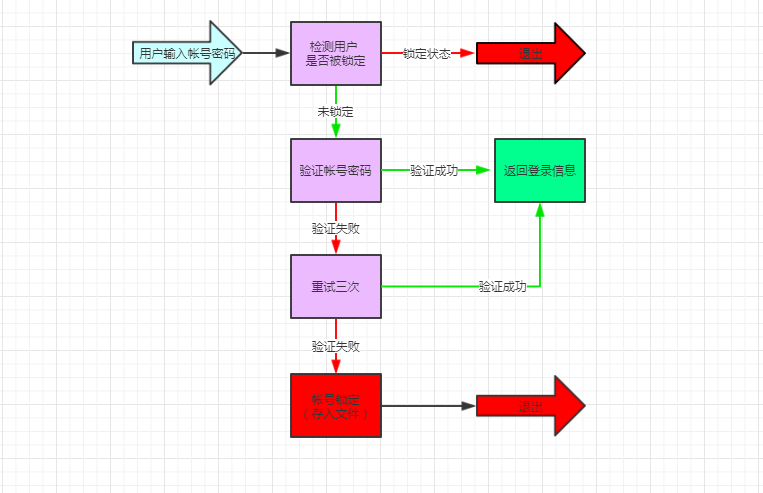

# 第一模块 开发基础
## 第一章 Python基础语法 作业
    
### 登录接口 功能需求
___
    基础需求：
      让用户输入用户名密码
      认证成功后显示欢迎信息
      输错三次后退出

    程序升级需求：
      可以支持多个用户登录 (提示，通过列表存多个账户信息)
      用户3次认证失败后，退出程序，再次启动程序尝试登录时，还是锁定状态（提示:需把用户锁定的状态存到文件里）
     
     
### 开发环境
___
 - Windows 10
 - Python 3.5.0
 - Pycharm 2019.1


### 流程图
___



### 运行程序
___
`python login.py`


### 登录用用户信息
___
    帐号： ['Pony', 'Jack', 'Robin']
    密码： ['123abc', 'abc123', 'abcefg']
    

### 程序运行效果
___
#####　1. 验证通过效果：
 ```
    D:\Payne\python-workdir\venv\Scripts\python.exe D:/Payne/python-workdir/luffycity-s8/login.py
    请输入用户名：Jack
    请输入密码：123456
    密码错误，请重试
    请输入用户名：Jaak
    [Jaak]该用户不存在，请检查
    请输入用户名：Jack
    请输入密码：abc123
    HI. [Jack] 欢迎登录
  ```
##### 2. 验证不通过效果：
 ```
    D:\Payne\python-workdir\venv\Scripts\python.exe D:/Payne/python-workdir/luffycity-s8/login.py
    请输入用户名：Jack
    请输入密码：abc
    密码错误，请重试
    请输入用户名：Jack
    请输入密码：123
    密码错误，请重试
    请输入用户名：Jack
    请输入密码：wer
    密码错误，请重试
    抱歉输入错误次数过多，帐号已被锁定

 ```
##### 3. 帐号锁定效果：
 ```
    D:\Payne\python-workdir\venv\Scripts\python.exe D:/Payne/python-workdir/luffycity-s8/login.py
    请输入用户名：Pony
    [Pony]该帐号已被锁定

 ```