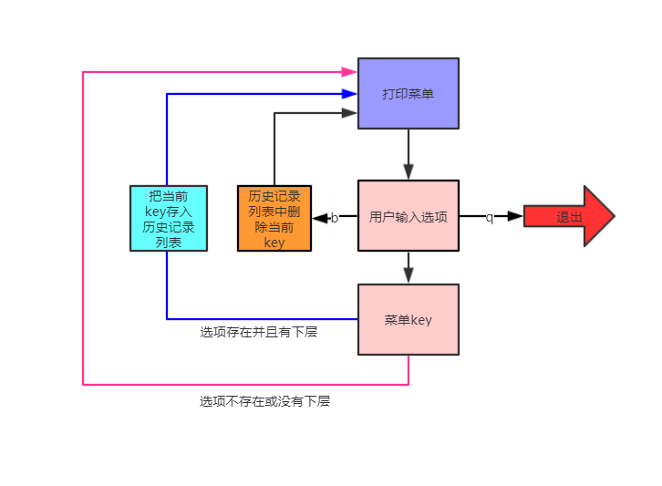

# 第一模块 开发基础
## 第二章 数据类型_字符编码_文件操作
    
### 作业：《多级菜单》
___
数据结构：
```python
menu = {
    '北京':{
        '海淀':{
            '五道口':{
                'soho':{},
                '网易':{},
                'google':{}
            },
            '中关村':{
                '爱奇艺':{},
                '汽车之家':{},
                'youku':{},
            },
            '上地':{
                '百度':{},
            },
        },
        '昌平':{
            '沙河':{
                '老男孩':{},
                '北航':{},
            },
            '天通苑':{},
            '回龙观':{},
        },
        '朝阳':{},
        '东城':{},
    },
    '上海':{
        '闵行':{
            "人民广场":{
                '炸鸡店':{}
            }
        },
        '闸北':{
            '火车站':{
                '携程':{}
            }
        },
        '浦东':{},
    },
    '山东':{},
}
```
    基础需求：
    1. 可依次选择进入各子菜单
    2. 可从任意一层往回退到上一层
    3. 可从任意一层退出程序
    所需新知识点：列表、字典
    
    升级需求：
    1. 使用一个while循环，且整体代码量不超过15行
     
### 开发环境
___
 - Windows 10
 - Python 3.5.0
 - Pycharm 2019.1


### 实现思路
___
    当用户输入第一层的key后，以这个key生成下层要访问的字典，再打印下层字典的key让用户选择下下层，以此类推...
    当用户要返回上一层时，我们需要知道上一层是在哪里，所以需要把用户输入的层级key按顺序存起来，作为历史记录，用于返回上层操作

### 流程图
___



### 运行程序
___
`python multilevel_menu.py`


### 登录用用户信息
___
    无需登录
    

### 程序运行效果
___
    ============中国城市列表============
    上海
    山东
    北京
    
    >>>请输入查找的地名【如要退出请按：q ; 返回上级菜单请按：b】 >>: 北京
    ============中国城市列表============
    海淀
    昌平
    东城
    朝阳
    
    >>>请输入查找的地名【如要退出请按：q ; 返回上级菜单请按：b】 >>: 昌平
    ============中国城市列表============
    沙河
    天通苑
    回龙观
    
    >>>请输入查找的地名【如要退出请按：q ; 返回上级菜单请按：b】 >>: 沙河
    ============中国城市列表============
    老男孩
    北航
    
    >>>请输入查找的地名【如要退出请按：q ; 返回上级菜单请按：b】 >>: 堓
    [堓]暂无下层信息或没有此选项，请重新选择
    ============中国城市列表============
    老男孩
    北航
    
    >>>请输入查找的地名【如要退出请按：q ; 返回上级菜单请按：b】 >>: 老男孩
    [老男孩]暂无下层信息或没有此选项，请重新选择
    ============中国城市列表============
    老男孩
    北航
    
    >>>请输入查找的地名【如要退出请按：q ; 返回上级菜单请按：b】 >>: 北航
    [北航]暂无下层信息或没有此选项，请重新选择
    ============中国城市列表============
    老男孩
    北航
    
    >>>请输入查找的地名【如要退出请按：q ; 返回上级菜单请按：b】 >>: b
    ============中国城市列表============
    沙河
    天通苑
    回龙观
    
    >>>请输入查找的地名【如要退出请按：q ; 返回上级菜单请按：b】 >>: b
    ============中国城市列表============
    海淀
    昌平
    东城
    朝阳
    
    >>>请输入查找的地名【如要退出请按：q ; 返回上级菜单请按：b】 >>: b
    ============中国城市列表============
    上海
    山东
    北京
    
    >>>请输入查找的地名【如要退出请按：q ; 返回上级菜单请按：b】 >>: b
    这已经是最上层了
    ============中国城市列表============
    上海
    山东
    北京
    
    >>>请输入查找的地名【如要退出请按：q ; 返回上级菜单请按：b】 >>: q
    欢迎您下次使用！再见
