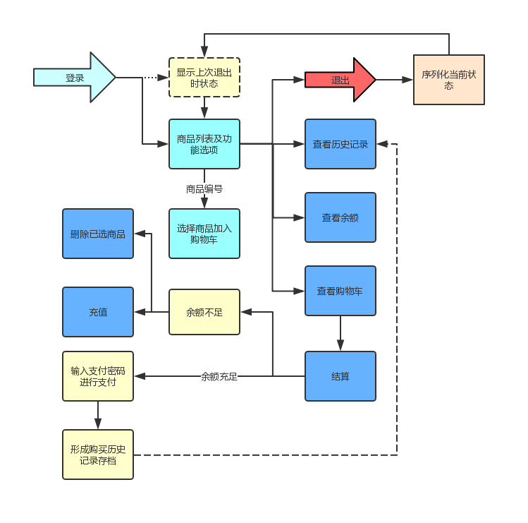

# 第一模块 开发基础
## 第二章 数据类型_字符编码_文件操作
    
### 作业：《购物车》
___
数据结构：
```python
goods = [
{"name": "电脑", "price": 1999},
{"name": "鼠标", "price": 10},
{"name": "游艇", "price": 20},
{"name": "美女", "price": 998},
...
]
```
    基本需求：75%
    1. 启动程序后，输入用户名密码后，让用户输入工资，然后打印商品列表
    2. 允许用户根据商品编号购买商品
    3. 用户选择商品后，检测余额是否够，够就直接扣款，不够就提醒
    4. 可随时退出，退出时，打印已购买商品和余额
    5. 在用户使用过程中， 关键输出，如余额，商品已加入购物车等消息，需高亮显示
    
    升级需求：10%
    1. 用户下一次登录后，输入用户名密码，直接回到上次的状态，即上次消费的余额什么的还是那些，再次登录可继续购买
    2. 允许查询之前的消费记录
     
     
### 开发环境
___
 - Windows 10
 - Python 3.5.0
 - Pycharm 2019.1


### 实现思路
___
    对购物历史记录用文件存档
    退出时序列化当前状态到文件

### 流程图
___



### 运行程序
___
`python shopping_cart.py`


### 登录用用户信息
___
    username: jack
    login_password: abc123
    pay_password: 123456
    

### 程序运行效果
___
  ##### 说明：
    程序运行时会在当前目录下创建三个文件,请注意脚本目录的权限设置
    本程序有使用一个自定义的colored模块,请注意一同下载后运行
    
  ##### 功能：
    1、可以添加商品到购物车，在余额足够的情况下进行支付购买，并记录购买历史
    2、在余额不足以支付购物车中商品时，可以充值再购买，或删除购物车中的某些商品
    3、退出时记录当时的购物车与余额状态，可以在下次登录时继续操作

  ##### 首次运行,需要进行充值：
    请输入你的帐号：jack
    请输入您的登录密码：abc
    登录密码错误,请重试：
    请输入您的登录密码：abc123
    
    登录成功，欢迎<jack>
    
    请输入你的充值金额（小写数字）: 5000
    =============商品列表=============
    0. 电脑  1999
    1. 鼠标  10
    2. 游艇  20
    3. 美女  998
    
    【请选择你购买的商品编号：(0-3); 查看消费记录:h ; 查看余额:l ; 查看购物车:s ; 退出:q】：
    
  ##### 再次运行，会显示上次退出进购物车与余额状态：
    请输入你的帐号：jack
    请输入您的登录密码：abc123
    
    登录成功，欢迎<jack>
    
    ### 上次退出时的购物车与余额状态:
    =============购物车==============
    0. 电脑  1999
    1. 鼠标  10
    2. 鼠标  10
    3. 游艇  20
    4. 游艇  20
    商品总价>>: 2059
    帐户余额：5000
    
    【按任意键继续，按q退出】：
    
  ##### 余额不足时，可以选择充值或删除已选商品：
    =============购物车==============
    0. 电脑  1999
    1. 鼠标  10
    2. 鼠标  10
    3. 游艇  20
    4. 游艇  20
    5. 电脑  1999
    6. 电脑  1999
    7. 电脑  1999
    8. 电脑  1999
    商品总价：10055
    
    您帐号余额为：5000
    
    【对不起你的余额不足! 充值:r ; 删除已选商品:d】
    
  ##### 结算
    =============商品列表=============
    0. 电脑  1999
    1. 鼠标  10
    2. 游艇  20
    3. 美女  998
    
    【请选择你购买的商品编号：(0-3); 查看消费记录:h ; 查看余额:l ; 查看购物车:s ; 退出:q】：s
    =============购物车==============
    0. 电脑  1999
    1. 鼠标  10
    2. 鼠标  10
    3. 游艇  20
    4. 游艇  20
    5. 电脑  1999
    6. 电脑  1999
    商品总价：6057
    
    您帐号余额为：7000
    
    【按任意键返回商品列表；支付请按:p】:p
    请输入您的支付密码：123456
    
    支付成功, 您的余额为：943
    
  ##### 查看消费记录：
    【请选择你购买的商品编号：(0-3); 查看消费记录:h ; 查看余额:l ; 查看购物车:s ; 退出:q】：h
    
    您的消费记录如下：
    2019-05-03 00:48:42 : 
    您购买了如下商品:
    0. 电脑 1999
    1. 鼠标 10
    2. 鼠标 10
    3. 游艇 20
    4. 游艇 20
    5. 电脑 1999
    6. 电脑 1999
    消费金额：6057
    --------------------
    
    【按任意键返回】:
    
  ##### 查看余额：
    【请选择你购买的商品编号：(0-3); 查看消费记录:h ; 查看余额:l ; 查看购物车:s ; 退出:q】：l
    
    您的余额为：943
    
    【按任意键返回】: