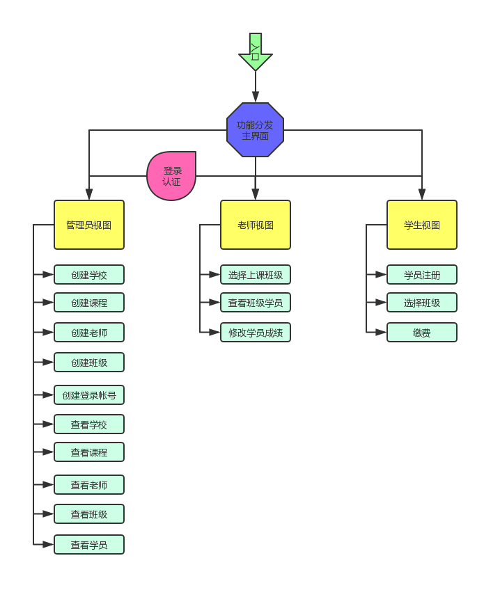

# 第三模块 面向对象

### 作业 开发一个选课系统
---
#### 功能需求
角色:学校、学员、课程、讲师
要求:
1. 创建北京、上海 2 所学校
2. 创建linux , python , go 3个课程 ， linux\py 在北京开， go 在上海开
3. 课程包含，周期，价格，通过学校创建课程 
4. 通过学校创建班级， 班级关联课程、讲师
5. 创建学员时，选择学校，关联班级
5. 创建讲师角色时要关联学校
6. 提供三个角色接口
    1. 学员视图， 可以注册， 交学费， 选择班级
    2. 讲师视图， 讲师可管理自己的班级， 上课时选择班级， 查看班级学员列表 ， 修改所管理的学员的成绩
    3. 管理视图，创建讲师， 创建班级，创建课程
7. 上面的操作产生的数据都通过pickle序列化保存到文件里

#### 开发环境
___
 - Windows 10
 - Python 3.5.0
 - Pycharm 2019.1

#### 实现思路
___
    对象创建与绑定规则约定
    一个学校可以有多个班级、课程、老师、学员
    一个班级绑定一门课程、一个老师，多个学生
    一个老师可以授课多个班级课程
    一门课程可以存在多个校区与班级
    一个学生只在存在一个校区一个班级
    
###### 对象属性提取：
    学校
    属性：学校名称，学校地址，课程列表，班级列表，老师列表，学员列表
    
    学员
    属性：姓名，年龄，性别，注册日期，所属班级，课程，课程分数，缴费状态
    
    课程
    属性：课程名称，价格，周期
    
    老师
    属性：姓名，薪水，授课班级列表
    
    班级
    属性：班级名称，班级课程，班级老师，班级学员列表
    
    管理员视图
    属性：登录用户
    方法：创建学校，创建班级，创建老师，创建课程
        
    学员视图
    属性：登录用户
    方法：注册，交学费，选择班级，选择课程，选择老师 
    
    老师视图
    属性：登录用户
    方法：选择上课班级，查看班级学员，修改所管理学员的成绩
    
###### 对象序列化格式
    各类型对象序列化到各类型文件中
    {'obj_name'：obj, }

    
#### 项目目录结构
___
    CourseSelectionSystem/      # 项目名称
    |-- REAMDME.md              # 说明文档
    |-- choice_course_flow.png  # 流程图
    |-- __init__.py
    |-- bin                     
    |   |-- __init__.py
    |   `-- start.py            # 启动文件
    |-- conf
    |   |-- __init__.py
    |   `-- settings.py         # 全局配置文件
    |-- core                # 核心代码目录
    |   |-- __init__.py
    |   |-- manager_view.py     # 管理视图
    |   |-- school.py           # 学校、老师、班级、课程、学生类
    |   |-- student_view.py     # 学生视图
    |   `-- teacher_view.py     # 老师视图
    |-- data                # 数据目录
    |   |-- __init__.py
    |   |-- db              # 序列化文件目录
    |   |   |-- account.pk      # 登录帐号文件
    |   |   |-- classes.pk      # 班级对象文件
    |   |   |-- courses.pk      # 课程对象文件
    |   |   |-- school.pk       # 学校对象文件
    |   |   |-- student.pk      # 学生对象文件
    |   |   `-- teacher.pk      # 老师对象文件
    |   `-- logs            # 日志目录
    `-- modules             # 自建模块目录
        |-- __init__.py
        |-- check_obj_exist.py      # 检查一个对象是不否存在于某个数据集中
        |-- generate_obj_data.py    # 从对象数据字典中生成符全条件的数据字典
        |-- is_number.py            # 检测对象是否是数字
        |-- login.py                # 登录认证
        |-- make_account.py         # 创建登录帐号
        |-- new_input.py            # 通过strip()方法处理过的input方法
        `-- serialization.py        # 数据序列化与反序列化操作
        

### 流程图
---

### 运行程序
___
`python3 CourseSelectionSystem/bin/start.py`

### 登录帐户信息
___
    1、帐户信息存于：account.json 文件
    2、程序运行后会默认创建一个admin 管理帐号：{"admin":{"pwd":"admin", "type":"Manager"}}
    3、老师帐号将在管理员视图创建老师对象时自动创建，登录帐号用于登录老师视图进行相差操作
    4、学生帐号需要在管理员视图中创建，创建帐号后才能登录学生视图进行操作
    
### 程序运行效果
___
    说明：数据的序列化在各视图退出的时候进行，如果非正常中断程序修改的数据将无法序列化到文件中

##### 主界面

    ========= LuffyCity ==========
    1. 管理员视图
    2. 学生视图
    3. 老师视图
    4. 退出
    请输入功能编号>>: 
    
    
##### 进入管理员视图主界面

    请输入[Manager]类型帐号密码
    User>>>: admin
    Password>>>: admin
    [Manager]:[admin]登录成功
    ========== MANAGER ===========
    1. 创建学校
    2. 创建课程
    3. 创建老师
    4. 创建班级
    5. 创建登录帐号
    6. 查看所有校区
    7. 查看所有课程
    8. 查看所有老师
    9. 查看所有班级
    10. 查看所有学生
    11. 查看所有帐户
    12. 退出
    请输入功能选项>>>: 

##### 进入学生视图主界面
    
    请输入[Student]类型帐号密码
    User>>>: jack
    Password>>>: abc123
    [Student]:[jack]登录成功
    ========== STUDENT ===========
    1. 学员注册
    2. 选择班级
    3. 缴费
    4. 查看当前学员信息
    5. 退出
    请输入功能选项>>>:  
    
    
##### 进入老师视图主界面
    
    请输入[Teacher]类型帐号密码
    User>>>: alex
    Password>>>: 123456
    [Teacher]:[alex]登录成功
    ========== TEACHER ===========
    1. 选择上课班级
    2. 查看班级学员
    3. 修改学员成绩
    4. 查看当前老师信息
    5. 退出
    请输入功能选项>>>: 
        