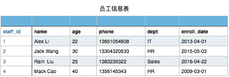
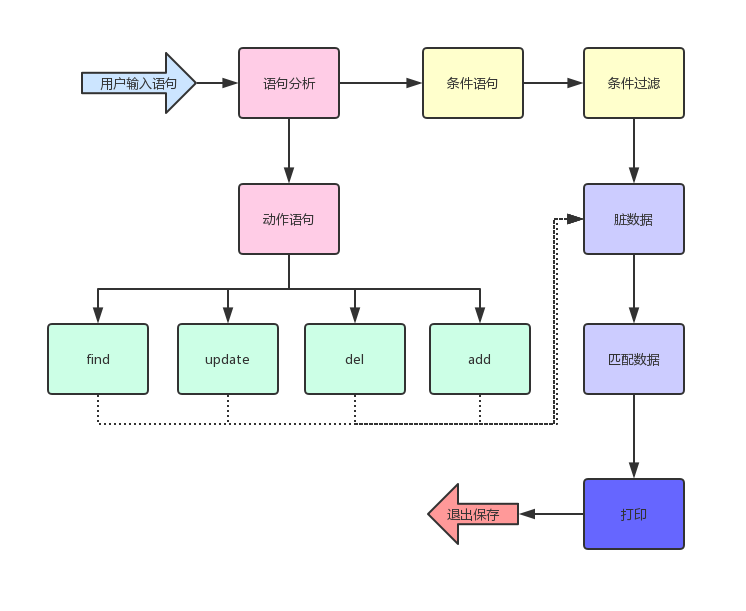

# 第二模块 函数编程
## 第一章 函数_装饰器_迭代器_内置方法
    
### 作业：《员工信息管理程序》
___
###### 员工信息表

    
###### 数据结构：
    1,Alex Li,22,13651054608,IT,2013-04-01
    2,Jack Wang,28,13451024608,HR,2015-01-07
    3,Rain Wang,21,13451054608,IT,2017-04-01
    4,Mack Qiao,44,15653354208,Sales,2016-02-01
    5,Rachel Chen,23,13351024606,IT,2013-03-16
    6,Eric Liu,19,18531054602,Marketing,2012-12-01
    7,Chao Zhang,21,13235324334,Administration,2011-08-08
    8,Kevin Chen,22,13151054603,Sales,2013-04-01
    9,Shit Wen,20,13351024602,IT,2017-07-03
    10,Shanshan Du,26,13698424612,Operation,2017-07-02

###### 需求：
    1.可进行模糊查询，语法至少支持下面3种查询语法:
        find name,age from staff_table where age > 22
        find * from staff_table where dept = "IT"
        find * from staff_table where enroll_date like "2013"
    
    2.可创建新员工纪录，以phone做唯一键(即不允许表里有手机号重复的情况)，staff_id需自增
        add staff_table Alex Li,25,134435344,IT,2015-10-29
    
    3.可删除指定员工信息纪录，输入员工id，即可删除
        del from staff_table where  id=3
    
    4.可修改员工信息，语法如下:
        UPDATE staff_table SET dept="Market" WHERE  dept = "IT" 把所有dept=IT的纪录的dept改成Market
        UPDATE staff_table SET age=25 WHERE  name = "Alex Li"  把name=Alex Li的纪录的年龄改成25
    
    5.以上每条语名执行完毕后，要显示这条语句影响了多少条纪录。 比如查询语句 就显示 查询出了多少条、修改语句就显示修改了多少条等。
     
      
### 开发环境
___
 - Windows 10
 - Python 3.5.0
 - Pycharm 2019.1

### 实现思路
___
    拆分语句，分隔出动作(find,add,update,del)语句，与条件语句(where)
    有where条件的，先查询符合条件的数据，再对数据进行相应动作的操作
    没有where条件的，对所有数据进行相应动作操作

### 流程图
___

### 运行程序
___
`python staff_manager.py`

### 登录用用户信息
___
    None
    

### 程序运行效果
___
  ##### 运行说明
    运行前需要先创建user_db文件
    
  ##### 帮助信息
    输入help可获取帮助信息[Staff Manager]>>: help
    [HELP]: 
        help加以下参数查看相关语句帮助信息
            find or -f   : 查询语句
            del or -d    : 删除语句
            add or -a    : 添加语句
            update or -u : 更新语句
        exit or q : 退出程序
        
  ##### help 相关语句的帮助信息
    输入help可获取帮助信息[Staff Manager]>>: help add
    [HELP]: 
        >>>可新增纪录，以phone做唯一键，staff_id自增
            add staff_table Alex Li,25,134435344,IT,2015‐10‐29
        
    输入help可获取帮助信息[Staff Manager]>>: 
    
  ##### find 查询员工信息
    输入help可获取帮助信息[Staff Manager]>>: find * from staff_table where age > 28
    ╒══════╤═══════════╤═══════╤═════════════╤═════════╤════════════╕
    │   id │ name      │   age │       phone │ dept    │ in_date    │
    ╞══════╪═══════════╪═══════╪═════════════╪═════════╪════════════╡
    │    1 │ Alex Li   │    33 │ 13651054608 │ Develop │ 2013-04-01 │
    ├──────┼───────────┼───────┼─────────────┼─────────┼────────────┤
    │    4 │ Mack Qiao │    44 │ 15653354208 │ Sales   │ 2016-02-01 │
    ╘══════╧═══════════╧═══════╧═════════════╧═════════╧════════════╛
    [INFO]: 查询到[2]条数据
    
  ##### update 修改信息
     输入help可获取帮助信息[Staff Manager]>>: update staff_table set dept='HR' where name='Eric Liu'
    ╒══════╤══════════╤═══════╤═════════════╤════════╤════════════╕
    │   id │ name     │   age │       phone │ dept   │ in_date    │
    ╞══════╪══════════╪═══════╪═════════════╪════════╪════════════╡
    │    6 │ Eric Liu │    19 │ 18531054602 │ HR     │ 2012-12-01 │
    ╘══════╧══════════╧═══════╧═════════════╧════════╧════════════╛
    [INFO]: 修改了[1]条数据
    
  ##### del 删除信息
    输入help可获取帮助信息[Staff Manager]>>: del from staff_table where id=13
    ╒══════╤═════════════╤═══════╤═════════════╤════════╤════════════╕
    │   id │ name        │   age │       phone │ dept   │ in_date    │
    ╞══════╪═════════════╪═══════╪═════════════╪════════╪════════════╡
    │   13 │ Wayne zheng │    27 │ 18666883321 │ IT     │ 2017-09-25 │
    ╘══════╧═════════════╧═══════╧═════════════╧════════╧════════════╛
    [INFO]: 删除了[1]条数据
  
  ##### add 新增信息
    输入help可获取帮助信息[Staff Manager]>>: add staff_table Jack Ma,55,13999991399,CEO,1999-09-09
    ╒══════╤═════════╤═══════╤═════════════╤════════╤════════════╕
    │   id │ name    │   age │       phone │ dept   │ in_date    │
    ╞══════╪═════════╪═══════╪═════════════╪════════╪════════════╡
    │   11 │ Jack Ma │    55 │ 13999991399 │ CEO    │ 1999-09-09 │
    ╘══════╧═════════╧═══════╧═════════════╧════════╧════════════╛
    [INFO]: 新增[1]条数据
    
  ##### del、update语句没加where条件时会提示确认操作
    输入help可获取帮助信息[Staff Manager]>>: update staff_table set dept='IT' 
    [INFO]: 温馨提示：del/update 语句未指定where条件将更新整个表中的数据
    确认此次操作请按[y] 放弃此次操作请按[b]>>:y
    ╒══════╤═════════════╤═══════╤═════════════╤════════╤════════════╕
    │   id │ name        │   age │       phone │ dept   │ in_date    │
    ╞══════╪═════════════╪═══════╪═════════════╪════════╪════════════╡
    │    1 │ Alex Li     │    33 │ 13651054608 │ IT     │ 2013-04-01 │
    ├──────┼─────────────┼───────┼─────────────┼────────┼────────────┤
    │    2 │ Jack Wang   │    28 │ 13451024608 │ IT     │ 2015-01-07 │
    ├──────┼─────────────┼───────┼─────────────┼────────┼────────────┤
    │    3 │ Rain Wang   │    21 │ 13451054608 │ IT     │ 2017-04-01 │
    ├──────┼─────────────┼───────┼─────────────┼────────┼────────────┤
    │    4 │ Mack Qiao   │    44 │ 15653354208 │ IT     │ 2016-02-01 │
    ├──────┼─────────────┼───────┼─────────────┼────────┼────────────┤
    │    5 │ Rachel Chen │    23 │ 13351024606 │ IT     │ 2013-03-16 │
    ├──────┼─────────────┼───────┼─────────────┼────────┼────────────┤
    │    6 │ Eric Liu    │    19 │ 18531054602 │ IT     │ 2012-12-01 │
    ├──────┼─────────────┼───────┼─────────────┼────────┼────────────┤
    │    7 │ Chao Zhang  │    21 │ 13235324334 │ IT     │ 2011-08-08 │
    ├──────┼─────────────┼───────┼─────────────┼────────┼────────────┤
    │    8 │ Kevin Chen  │    22 │ 13151054603 │ IT     │ 2013-04-01 │
    ├──────┼─────────────┼───────┼─────────────┼────────┼────────────┤
    │    9 │ Shit Wen    │    20 │ 13351024602 │ IT     │ 2017-07-03 │
    ├──────┼─────────────┼───────┼─────────────┼────────┼────────────┤
    │   10 │ Shanshan Du │    26 │ 13698424612 │ IT     │ 2017-07-02 │
    ├──────┼─────────────┼───────┼─────────────┼────────┼────────────┤
    │   13 │ Wayne zheng │    27 │ 18666883321 │ IT     │ 2017-09-25 │
    ╘══════╧═════════════╧═══════╧═════════════╧════════╧════════════╛
    [INFO]: 修改了[11]条数据