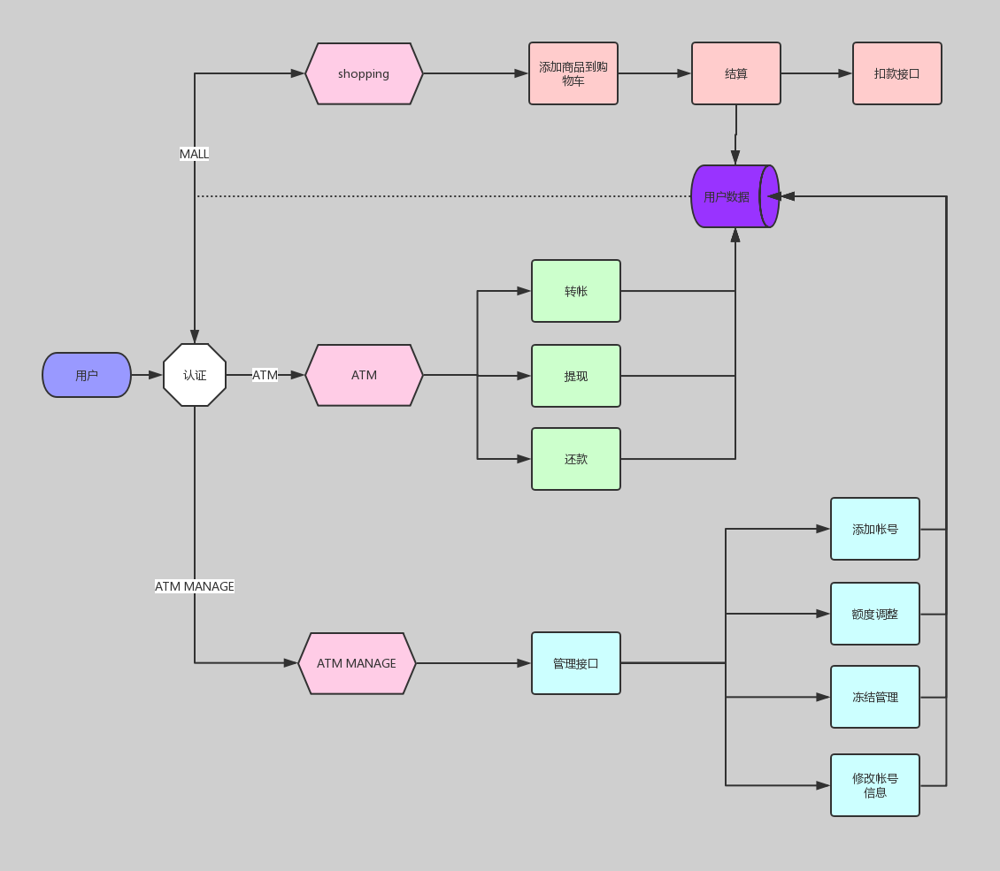

# 第二模块 函数编程
## 第二章 常用模块

### 作业 模拟实现一个ATM + 购物商城程序
---
#### 功能需求
1. 额度 15000或自定义
2. 实现购物商城，买东西加入 购物车，调用信用卡接口结账
3. 可以提现，手续费5%
4. 支持多账户登录
5. 支持账户间转账
6. 记录每月日常消费流水
7. 提供还款接口
8. ATM记录操作日志
9. 提供管理接口，包括添加账户、用户额度，冻结账户等。。。
10. 用户认证用装饰器

#### 开发环境
___
 - Windows 10
 - Python 3.5.0
 - Pycharm 2019.1

#### 实现思路
___
    功能拆分，接口调用
    
    项目目录结构：
    atm_shopping_mall/
    |-- README.md     
    |-- atm_shopping_mall_flow.png
    |-- __init__.py
    |-- bin                
    |   |-- __init__.py
    |   `-- start.py        # 项目主入口执行程序
    |-- conf              
    |   |-- __init__.py
    |   `-- settings.py     # 配置文件
    |-- atm                 # ATM功能app
    |   |-- __init__.py
    |   |-- bin
    |   |   |-- __init__.py
    |   |   `-- atm.py      # ATM app 入口
    |   |-- core            
    |   |   |-- __init__.py
    |   |   |-- repayment.py    # 还款功能
    |   |   |-- transfer.py     # 转帐功能
    |   |   `-- withdrawal.py   # 提现功能
    |   `-- manage          # ATM管理app
    |       |-- __init__.py
    |       |-- _add.py         # 新增帐户
    |       |-- _frozen.py      # 帐号冻结管理
    |       |-- _quota.py       # 信用额度调整
    |       `-- atm_manage.py   # ATM管理入口
    |-- data                # 数据目录
    |   |-- products.db     # 商品数据库
    |   |-- __init__.py
    |   |-- account         # 帐号数据目录
    |   |   |-- admin       # 管理员帐号目录(一个帐号一个文件)
    |   |   |   |-- admin.json
    |   |   `-- user        # 用户帐号目录(一个帐号一个文件)
    |   |       |-- jack.json
    |   |       |-- pony.json
    |   |       `-- robin.json
    |   |-- logs            # 日志目录(各功能模块分开存档)
    |   |   |-- access.log
    |   |   |-- login.log
    |   |   |-- mall.log
    |   |   |-- repayment.log
    |   |   |-- transfer.log
    |   |   `-- withdrawal.log
    |   |-- records         # 用户消费记录目录(一个用户一个文件)
    |   |   |-- jack_records.txt
    |   |   `-- pony_records.txt
    |   `-- status          # 用户购物车状态目录(一个用户一个文件)
    |       `-- jack_shop_car.json
    |-- mall                # 购物商城app
    |   |-- __init__.py
    |   `-- bin
    |       |-- __init__.py
    |       `-- mall.py     # 购物商城app 入口
    `-- modules             # 功能模块
        |-- __init__.py
        |-- check_user_exist.py     # 检测用户是否存在或获取用户数据文件路径
        |-- colored.py              # 彩色字体输出
        |-- is_number.py            # 检测字符串是否是数字
        |-- logger.py               # log记录
        |-- login.py                # 帐号认证装饰器
        |-- md5.py                  # 生成MD5值
        `-- serialization.py        # 数据序列化
    

### 流程图
---

### 运行程序
___
`python3 atm_shopping_mall/bin/start.py`

### 登录用用户信息
___
    帐户初始金额均为: 15000元
    jack: abc123
    pony: 123abc
    robin: 123456
    管理帐号
    admin: admin

### 程序运行效果
---
##### 主界面
    欢迎光临红太阳集团

    -----中国红太阳集团-----
        1. 购物商城
        2. ATM (提现、转帐、还款)
        3. ATM管理后台
        4. 退出
        
    请输入选项[1|2|3|4]>>: 
    
    
##### 购物商城主界面
    请输入用户帐号与密码
    User>>>: jack
    Password>>>: abc123
    ===========红太阳购物中心============
    0. 电脑  8999
    1. 鼠标  89
    2. 掌机  2899
    3. 手机  998
    4. 键盘  668
    5. 平板  1499
    6. 音箱  328
    
    [请选择你购买的商品编号：(0-6); 查看消费记录:h ; 查看余额:l ; 查看购物车:s ; 退出:q]：

##### ATM主界面
    请输入用户帐号与密码
    User>>>: jack
    Password>>>: abc123
    [jack] 欢迎光临
    
        -------------ATM--------------
        1. 帐号信息
        2. 转帐
        3. 提现
        4. 还款
        
    请选择功能选项[1|2|3|4]; 退出[q|Q]>>: 
    
    
##### ATM管理主界面
    请输入管理员帐号与密码
    User>>>: admin
    Password>>>: admin
    [admin] 欢迎光临
    
        ----------ATM MANAGE----------
        1. 添加帐号
        2. 调整额度
        3. 冻结帐号
        
    请输入功能选项[1|2|3]; 退出[q|Q]>>: 